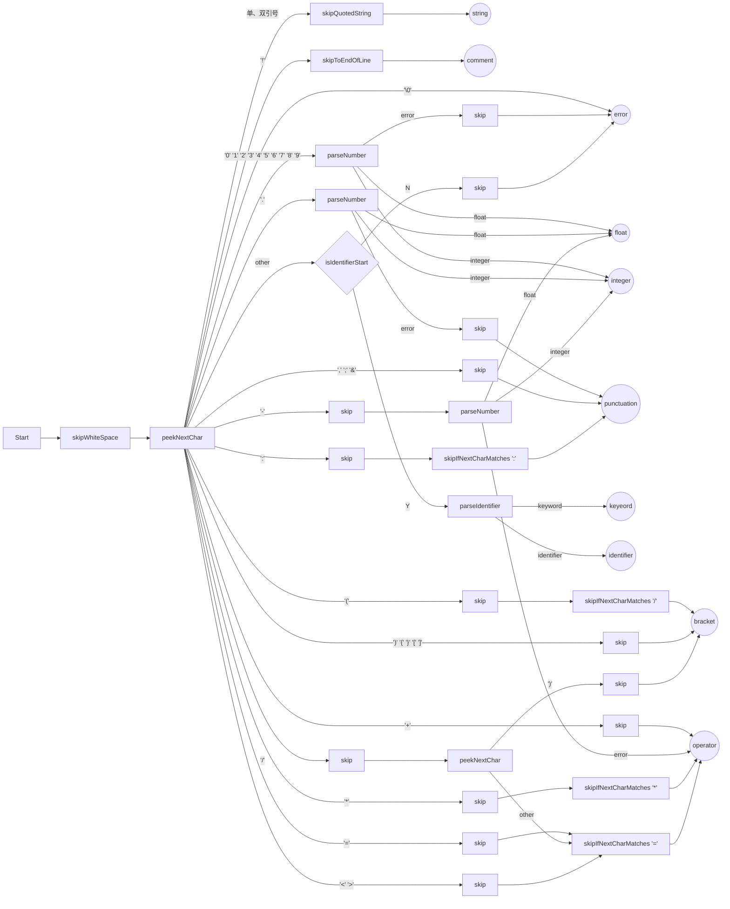
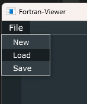
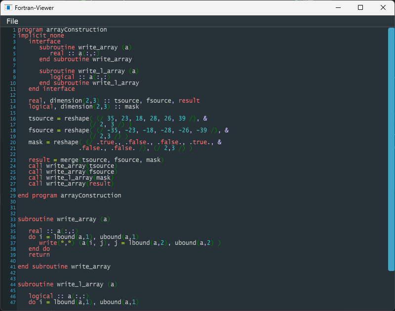
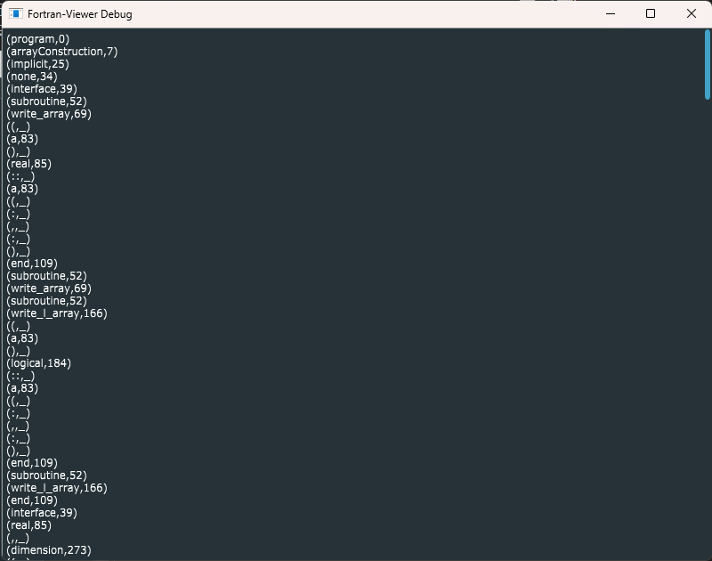
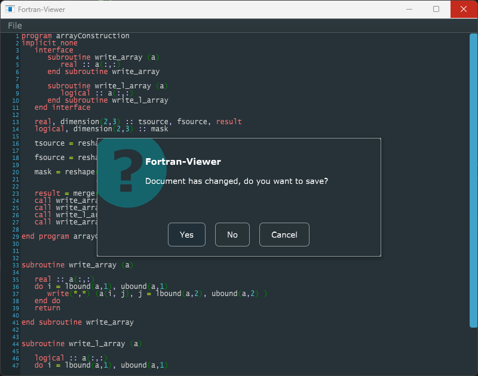

## 1 设计目的及设计要求
题目：简化的FORTRAN语言词法分析程序设计  
设计内容及要求：将教材P.42上的表3.1的词法分析器构造出来，限制条件如教材所述。保留字的识别按标识符一样识别，通过查找保留字表区分是保留字还是标识符。程序能够从用户输入的源程序中，识别出的单词符号，并用二元式表示，显示输出或输出到文件中。

## 2 开发环境描述
- Microsoft Windows [Version 10.0.22621.1848]
- CMake 3.22.4
- Ninja 1.10.2
- MSVC 14.36.32532
- JUCE 7.0.5

## 3 设计内容
该程序通过文本编辑器编辑Fortran代码，对代码进行实时词法分析生成二元式与代码染色。代码可以从文件加载与保存到文件。  


## 4 设计的输入和输出形式
程序输入Fortran自由格式代码，扩展名为f90，f95，f03，f08或f15，输出二元式并对编辑器中代码进行染色。  
以下为几段示例Fortran代码  
```fortran
program gravitationalDisp

    ! this program calculates vertical motion under gravity
    implicit none

    ! gravitational acceleration
    real, parameter :: g = 9.81

    ! variable declaration
    real :: s ! displacement
    real :: t ! time
    real :: u ! initial speed

    ! assigning values
    t = 5.0
    u = 50
            
    ! displacement
    s = u * t - g * (t ** 2) / 2

    ! output
    print *, "Time = ", t
    print *, 'Displacement = ', s

end program gravitationalDisp
```
```fortran
program rangePrecision
implicit none

   real:: x, y, z
   x = 1.5e+40
   y = 3.73e+40
   z = x * y 
   print *, z
   
end program rangePrecision
```
```fortran
module constants  
implicit none 

   real, parameter, private :: pi = 3.1415926536  
   real, parameter, private :: e = 2.7182818285 
   
contains      
   subroutine show_consts()          
      print*, "Pi = ", pi          
      print*, "e = ", e     
   end subroutine show_consts 
   
   function ePowerx(x)result(ePx) 
   implicit none
      real::x
      real::ePx
      ePx = e ** x
   end function ePowerx
    
   function areaCircle(r)result(a)  
   implicit none
      real::r
      real::a
      a = pi * r**2  
   end function areaCircle
    
end module constants 


program module_example     
use constants      
implicit none     

   call show_consts() 
   
   print*, "e raised to the power of 2.0 = ", ePowerx(2.0)
   print*, "Area of a circle with radius 7.0 = ", areaCircle(7.0)  
   
end program module_example
```
```fortran
program arrayConstruction
implicit none
   interface
      subroutine write_array (a)
         real :: a(:,:)
      end subroutine write_array
      
      subroutine write_l_array (a)
         logical :: a(:,:)
      end subroutine write_l_array
   end interface

   real, dimension(2,3) :: tsource, fsource, result
   logical, dimension(2,3) :: mask
   
   tsource = reshape( (/ 35, 23, 18, 28, 26, 39 /), &
                    (/ 2, 3 /) )
   fsource = reshape( (/ -35, -23, -18, -28, -26, -39 /), &
                    (/ 2,3 /) )
   mask = reshape( (/ .true., .false., .false., .true., &
                 .false., .false. /), (/ 2,3 /) )

   result = merge(tsource, fsource, mask)
   call write_array(tsource)
   call write_array(fsource)
   call write_l_array(mask)
   call write_array(result)
   
end program arrayConstruction


subroutine write_array (a)

   real :: a(:,:)
   do i = lbound(a,1), ubound(a,1)
      write(*,*) (a(i, j), j = lbound(a,2), ubound(a,2) )
   end do
   return
   
end subroutine write_array


subroutine write_l_array (a)

   logical :: a(:,:)
   do i = lbound(a,1), ubound(a,1)
      write(*,*) (a(i, j), j= lbound(a,2), ubound(a,2))
   end do
   return
   
end subroutine write_l_array
```

## 5 程序运行结果
通过File菜单可以新建、加载与保存Fortran文件：  
  

打开本地保存的f90文件，代码染色与二元式输出如下：  
  
  

编辑器内容发生修改后，关闭程序时提示保存：  
  

## 6 总结
这是我所有做过的成型项目里做得最快的一个了，从下午两点直播新建文件夹开始做，到晚上七点结束，一共五个小时。  
用的都是早就熟练的技术，可以说是速战速决。  
做完之后发现忘了吃晚饭，肚子好饿啊。  
二编：原来课设要求输出二元式，验收时候花了一个小时加上了。  

## 7 源程序
FortranTokeniser.h
```cpp
#pragma once
#include <JuceHeader.h>

class FortranTokeniser final : public juce::CodeTokeniser {
public:
	FortranTokeniser();
	~FortranTokeniser() override;

	int readNextToken(juce::CodeDocument::Iterator&) override;
	juce::CodeEditorComponent::ColourScheme getDefaultColourScheme() override;

	enum TokenType {
		tokenType_error = 0,
		tokenType_comment,
		tokenType_keyword,
		tokenType_operator,
		tokenType_identifier,
		tokenType_integer,
		tokenType_float,
		tokenType_string,
		tokenType_bracket,
		tokenType_punctuation
	};

private:
	JUCE_DECLARE_NON_COPYABLE_WITH_LEAK_DETECTOR(FortranTokeniser)
};
```

FortranTokeniser.cpp
```cpp
#include "FortranTokeniser.h"

struct FortranTokeniserFunctions final {
	static bool isReservedKeyword(juce::String::CharPointerType token, const int tokenLength) noexcept {
		static const char* const keywords2Char[] = {
			"do", "go", "to", "if", "in", "or", "eq", "ne", "gt", "lt", "ge", "le", nullptr};

		static const char* const keywords3Char[] = {
			"end", "len", "out", "use", "and", "eqv", "not", nullptr};

		static const char* const keywords4Char[] = {
			"data", "call", "case", "else", "exit", "kind", "only", "real", "save",
			"stop", "then", "type", "open", "read", "true", "neqv", "none", nullptr};

		static const char* const keywords5Char[] = {
			"block", "cycle", "entry", "inout", "pause", "where", "while", "close",
			"print", "write", "false", nullptr};

		static const char* const keywords6Char[] = {
			"assign", "common", "double", "intent", "module", "public", "result",
			"return", "select", "target", "format", "rewind", nullptr };

		static const char* const keywords7Char[] = {
			"complex", "default", "integer", "logical", "nullify", "pointer",
			"private", "program", "endfile", "inquire", nullptr };

		static const char* const keywords8Char[] = {
			"allocate", "contains", "continue", "external", "function", "implicit",
			"namelist", "operator", "optional", nullptr };

		static const char* const keywords9Char[] = {
			"character", "precision", "elsewhere", "interface", "intrinsic",
			"parameter", "recursive", "backspace", nullptr };

		static const char* const keywordsOther[] = {
			"assignment", "deallocate", "subroutine", "allocatable", "equivalence", nullptr };

		const char* const* k;

		switch (tokenLength) {
		case 2:   k = keywords2Char; break;
		case 3:   k = keywords3Char; break;
		case 4:   k = keywords4Char; break;
		case 5:   k = keywords5Char; break;
		case 6:   k = keywords6Char; break;
		case 7:   k = keywords7Char; break;
		case 8:   k = keywords8Char; break;
		case 9:   k = keywords9Char; break;

		default:
			if (tokenLength < 2 || tokenLength > 16)
				return false;

			k = keywordsOther;
			break;
		}

		for (int i = 0; k[i] != nullptr; ++i)
			if (token.compare(juce::CharPointer_ASCII(k[i])) == 0)
				return true;

		return false;
	}

	template <typename Iterator>
	static int parseIdentifier(Iterator& source) noexcept {
		int tokenLength = 0;
		juce::String::CharPointerType::CharType possibleIdentifier[100] = {};
		juce::String::CharPointerType possible(possibleIdentifier);

		while (juce::CppTokeniserFunctions::isIdentifierBody(source.peekNextChar())) {
			auto c = source.nextChar();

			if (tokenLength < 32)
				possible.write(c);

			++tokenLength;
		}

		if (tokenLength > 1 && tokenLength <= 16) {
			possible.writeNull();

			if (isReservedKeyword(juce::String::CharPointerType(possibleIdentifier), tokenLength))
				return FortranTokeniser::tokenType_keyword;
		}

		return FortranTokeniser::tokenType_identifier;
	}

	template <typename Iterator>
	static int readNextToken(Iterator& source) {
		source.skipWhitespace();

		auto firstChar = source.peekNextChar();

		switch (firstChar) {
		case 0:
			break;

		case '0':   case '1':   case '2':   case '3':   case '4':
		case '5':   case '6':   case '7':   case '8':   case '9':
		case '.': {
			auto result = juce::CppTokeniserFunctions::parseNumber(source);

			if (result == FortranTokeniser::tokenType_error) {
				source.skip();

				if (firstChar == '.')
					return FortranTokeniser::tokenType_punctuation;
			}

			return result;
		}

		case ',':
		case ';':
		case '&':
			source.skip();
			return FortranTokeniser::tokenType_punctuation;

		case ':':
			source.skip();
			juce::CppTokeniserFunctions::skipIfNextCharMatches(source, ':');
			return FortranTokeniser::tokenType_punctuation;

		case '(':
			source.skip();
			juce::CppTokeniserFunctions::skipIfNextCharMatches(source, '/');
			return FortranTokeniser::tokenType_bracket;

		case ')':
		case '{':   case '}':
		case '[':   case ']':
			source.skip();
			return FortranTokeniser::tokenType_bracket;

		case '"':
		case '\'':
			juce::CppTokeniserFunctions::skipQuotedString(source);
			return FortranTokeniser::tokenType_string;

		case '+':
			source.skip();
			return FortranTokeniser::tokenType_operator;

		case '-': {
			source.skip();
			auto result = juce::CppTokeniserFunctions::parseNumber(source);

			if (result == FortranTokeniser::tokenType_error) {
				return FortranTokeniser::tokenType_operator;
			}

			return result;
		}

		case '!':
			source.skipToEndOfLine();
			return FortranTokeniser::tokenType_comment;

		case '*':
			source.skip();
			juce::CppTokeniserFunctions::skipIfNextCharMatches(source, '*');
			return FortranTokeniser::tokenType_operator;

		case '=':
			source.skip();
			juce::CppTokeniserFunctions::skipIfNextCharMatches(source, '=');
			return FortranTokeniser::tokenType_operator;

		case '/':
			source.skip();

			if (source.peekNextChar() == ')') {
				source.skip();
				return FortranTokeniser::tokenType_bracket;
			}

			juce::CppTokeniserFunctions::skipIfNextCharMatches(source, '=');
			return FortranTokeniser::tokenType_operator;

		case '<':   case '>':
			source.skip();
			juce::CppTokeniserFunctions::skipIfNextCharMatches(source, '=');
			return FortranTokeniser::tokenType_operator;

		default:
			if (juce::CppTokeniserFunctions::isIdentifierStart(firstChar))
				return parseIdentifier(source);

			source.skip();
			break;
		}

		return FortranTokeniser::tokenType_error;
	}
};

FortranTokeniser::FortranTokeniser() {}
FortranTokeniser::~FortranTokeniser() {}

int FortranTokeniser::readNextToken(juce::CodeDocument::Iterator& source) {
	return FortranTokeniserFunctions::readNextToken(source);
}

juce::CodeEditorComponent::ColourScheme FortranTokeniser::getDefaultColourScheme() {
	juce::CodeEditorComponent::ColourScheme cs;

	cs.set("Error", juce::Colour{0xffe60000});
	cs.set("Comment", juce::Colour{0xff72d20c});
	cs.set("Keyword", juce::Colour{0xffee6f6f});
	cs.set("Operator", juce::Colour{0xffc4eb19});
	cs.set("Identifier", juce::Colour{0xffcfcfcf});
	cs.set("Integer", juce::Colour{0xff42c8c4});
	cs.set("Float", juce::Colour{0xff885500});
	cs.set("String", juce::Colour{0xffbc45dd});
	cs.set("Bracket", juce::Colour{0xff058202});
	cs.set("Punctuation", juce::Colour{0xffcfbeff});

	return cs;
}
```

其余代码见 <https://github.com/FangCunWuChang/Fortran-Viewer>  
